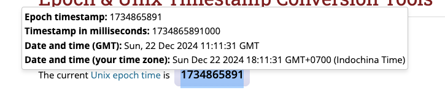

#  Simple Epoch Converter


# 


A lightweight Chrome extension that converts UNIX/Epoch timestamps to readable UTC and local time. It supports both seconds (10-digit) and milliseconds (13-digit) formats. When a user selects a timestamp on any webpage, a popup tooltip will display the converted date/time. Additionally, the user can manually input a timestamp in the extension’s popup.


## Features

- Auto-Detection of seconds or milliseconds
- Select text on any webpage to automatically display a date/time popup
- Manual Input via extension popup

## Getting Started


  1. Clone or Download
      ```bash
      git clone https://github.com/phongsakron/simple-epoch-converter.git
      cd simple-epoch-converter
      ```
  2. Install Dependencies
      ```bash
      npm install
      ```
  3. Build the Project
      ```bash
      npm run build
      ```
      This will compile your TypeScript files into the build/ folder.
  4. Load the Extension in Chrome
      - Go to chrome://extensions.
      - Enable Developer Mode (top-right toggle).
      - Click Load unpacked.
      - Select the build folder of this project.
      - The Simple Epoch Converter icon should appear in your toolbar.

## Icon Credit

[Clock Arrow](https://icons8.com/icon/jD3LImHUlMKC/clock-arrow) icon by Icons8

## Contribution

Suggestions and pull requests are welcomed!.

---

This project was bootstrapped with [Chrome Extension CLI](https://github.com/dutiyesh/chrome-extension-cli)

